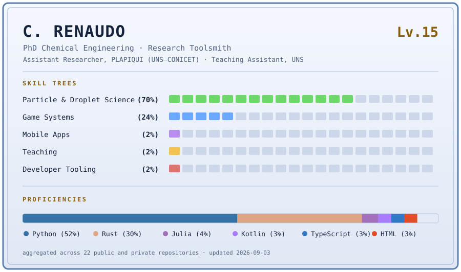

<picture>
  <source media="(prefers-color-scheme: dark)" srcset="assets/character-sheet-dark.svg">
  <source media="(prefers-color-scheme: light)" srcset="assets/character-sheet-light.svg">
  
</picture>

PhD in Chemical Engineering. Assistant Researcher at **PLAPIQUI (UNS–CONICET)** and Teaching
Assistant in the Chemical Engineering Department at **Universidad Nacional del Sur**, in
Bahía Blanca, Argentina.

I work on particle technology and droplet physics, and I build the software those two things
need — image analysis, numerical models, instrument parsers, and the desktop tools that wrap
them. Mostly Python and Rust. Occasionally a game engine, for the fun of it.

---

## ⚔️ Main quests

| Quest | Realm | What it is |
|---|---|---|
| **[easy-rpg-REditor](https://github.com/carenaudo/easy-rpg-REditor)** `MAIN QUEST` | Rust | An unofficial map and database editor for RPG Maker 2000/2003, built on `lcf-core` — a pure-Rust reimplementation of the LCF binary format. Tile painting, event editing, resource manager, MIDI synthesis, 8 UI languages, 12 themes. |
| **[Menipy](https://github.com/carenaudo/Menipy)** `ALPHA` | Python | Droplet and meniscus shape analysis from images — pendant and sessile drop. PySide6 GUI plus a headless CLI, modelled as explicit pipelines: load, preprocess, segment, fit, measure, report. |
| **[uv-migrator](https://github.com/carenaudo/uv-migrator)** `NEW` | Rust | Migrates Python virtual environments to [`uv`](https://github.com/astral-sh/uv) and reclaims the disk they were wasting. A 3 MB CLI and a 6.6 MB native GUI — no Electron, no WebView. |
| **[cargo-trim](https://github.com/carenaudo/cargo-trim)** `NEW` | Rust | Finds every nested Cargo `target/` directory on a drive, in parallel, and shows you the damage in a sorted table before deleting anything. |
| **[egui-shadcn](https://github.com/carenaudo/egui-shadcn)** `PARTY MEMBER` | Rust | shadcn-styled components for `egui`. Upstream is [pjankiewicz/egui-shadcn](https://github.com/pjankiewicz/egui-shadcn); I contribute back. |

## 🔬 Research log

The work behind most of the code, some of it still unpublished:

- **Droplet evaporation and cooling** — coupled heat and mass transfer for water droplets
  in air, comparing Wilson, Abramzon–Sirignano and classical D²-law formulations under
  adaptive ODE solvers with event detection.
- **Agricultural spray drift** — atomization, transport, evaporation and deposition,
  assembled as a literature knowledge base where every implemented model stays traceable
  to the equations in its source paper.
- **Population balance methods** — independently resolving aggregated, broken,
  coated/attritioned and newborn particles. Solvers written across Fortran, Julia and
  Python, because the reference implementations were.
- **Particle size distribution instrumentation** — parsing Horiba LA-950 `.ngb` (OLE/CFB)
  binaries into Dv10/Dv50/Dv90 metrics and client-ready reports, with a Python
  implementation shipping today and a Rust port tracking it for parity.
- **Grain morphometry** — sand-grain segmentation with MobileSAM/ONNX, then roundness and
  sphericity measurement and corner annotation.

## 🎲 Side quests

Reverse-engineering the RPG Maker 2000/2003 file formats turned into a whole party of
projects: `easy-rpg-REditor` above is the public one, alongside a native Rust engine and
editor workspace, an earlier Python engine, an asset pipeline, and a Godot experiment.
Much of it is built by pair-programming with an AI assistant — an honest experiment in how
far that goes on a real, file-format-accurate desktop tool, and one I write about.

None of it is affiliated with or endorsed by [EasyRPG](https://easyrpg.org/), whose open
documentation of the LCF format and `liblcf` reference implementation made it possible.

## 🎓 Teaching

As a Teaching Assistant in the Chemical Engineering Department at UNS: undergraduate fluid
mechanics and particulate solids processing, run through GitHub Classroom as solved
exercises in notebooks, plus course tooling and a theory corpus for the Particle Engineering
group. Reproducibility is a grading criterion, not a nice-to-have.

## 📜 Dev log

Notes on scientific computing, Rust and Python engineering, AI-assisted development, and
teaching — at **[carenaudo.github.io/carenaudo](https://carenaudo.github.io/carenaudo/)**.

<!-- POSTS:START -->
- **[A log for the tooling](https://carenaudo.github.io/carenaudo/blog/a-log-for-the-tooling/)** &middot; 2026-09-02
<!-- POSTS:END -->

## 🎒 Inventory

Open pack

**Languages** — Python, Rust, Julia, Fortran, TypeScript, a little C++
**Scientific** — NumPy, SciPy, OpenCV, CoolProp, Matplotlib, Jupyter, Streamlit
**Desktop** — PySide6/Qt, egui/eframe, wgpu, rodio, rustysynth
**Tooling** — Cargo, uv, pytest, pre-commit, GitHub Actions, Wrangler
**Terrain** — Windows-first, cross-platform where it counts

---

The character sheet above is regenerated weekly from the GitHub API. Its totals cover
public and private repositories; the private ones stay unnamed.
